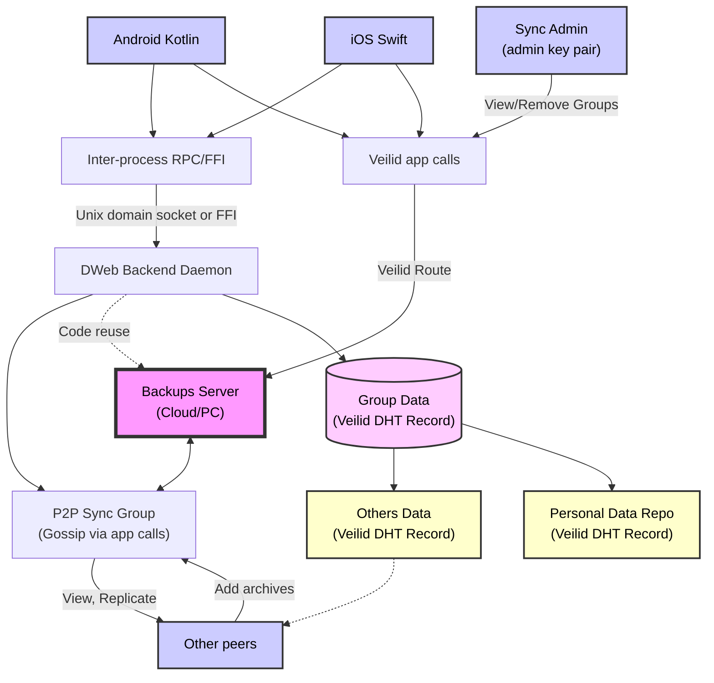

# save-dweb-backend
DWeb Backend for the Save app based on Veilid and Iroh

## Architecture

## Plans

We'll make use of Veilid for peer discovery and connections, and for public key cryptography. Iroh will be used for blob replication. We'll make an adapter to iroh's store class based on veilid's protected store.

Flow looks like this:
- if user has no groups, they create a new one
- user loads group info via the dht
- user loads the other users DataRepos and tunnels from the dht
- the user then creates a new DataRepo for the group and advertises their tunnel
- when trying to download a file it'll send a message to the others to ask who "has" the blob
- it will then use the iroh collections/blobs sync protocol to download in paralell

### Backend Core Class

- init storage adapters
- init veilid
- track ongoing blob requests / group participation
    - map of requests/responses with group and blob info?
- method to `loadGroup(keypair) => Group`
- veilid table is used to cache group data and personal repo info

### Group

- identifed by a veilid dht record keypair
- keypair secret is used to generate encryption secret for values in dht
- first subkey is the group name
- other subkeys are encrypted with the secret in the format of `encrypted(repoPublicKey)`
- `constructor(routingContext, keyPair)`
- `listRepos() => DataRepo`
- `lstTunnels() => []PublicKey`
- `getBlob(groupPublicKey, repoPublicKey, fileName) => Result<async iterator bytes[]>`
- `joinGroup(keyPair) => Result`
- `listMembers(groupPublicKey) => {name, repooPublicKey}[]`
- `encrypt([]bytes data) => Result<bytes[]>`
- `decrypt([]bytes encryptedData) => Result<bytes[]>`
- `dhtGet(subkey number) => Result<bytes[]>` (decrypts after get)
- `dhtPut(subkey number, bytes[]) => Result` (encrypts before put)
- `dhtNumKeys() => Result<number>`
- `dhtHasRepo(publicKey) => Result<bool>`

### DataRepo

- identified with veilid dht record keypair
- encrypted with same secret as group
- first subkey is a json blob with `{"name": "example"}`
- second is the hash of an iroh collection
- other subkeys are veilid tunnel public keys
    - before "closing" we should make sure to remove our tunnel from the list
- collection points to blob hashes
- read/list APIs for readers
- writing does the following
    - upload blob and get hash
    - update collection key to set to hash
    - update dht record with new collection root hash
- delete should just clear the key from the collection and trigger an update
    - TODO: How do we deal with clearing delete? Seperate data stores per repo?
- constructor should take `(groupSecret, publicKey, secretKey?)`
- `getName() => Name?`
- `getTunnels() => []PublicKey`
- `write(name String, async iterator []bytes) => Result`
- `read(name) => Result<async iteraor []bytes>`
- `syncAll(onProgress) => Result`

## Radmap:

- get veilid building and running inside backend class
- create groups and publish to veilid with name, read name from keypair
- create data repo with name and advertise to dht/read name back
- add own repo to group, list known repos, get their names
- add tunnel to own repo, send "ping" app_call to others
- track collection for data repo and add data to it, update dht with hash
- get iroh replication for collection using app_call to tunnels n repo
- attempt to send requests to tunnels of other peers and do paralell reads for those that have the data (track dead tunnels to add to ignore list)
- standardize on ABI to invoke via FFI
- standardize on URI scheme for linking to groups
- exend uri scheme for also adding data repo keypair for migrating devices
- "backup server" listening for rpc to start replicating groups

