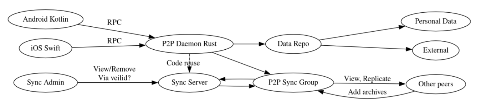
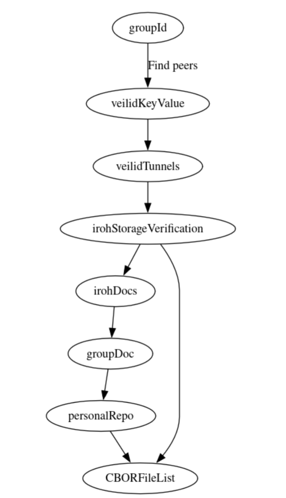
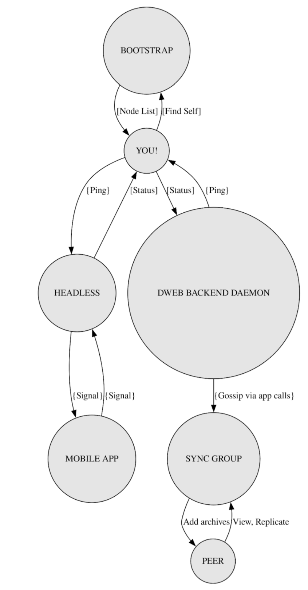
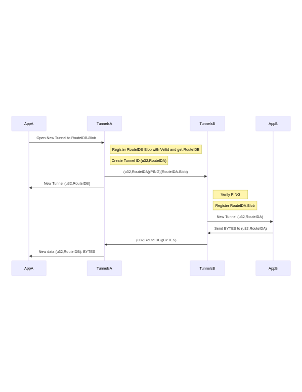

# *Save* DWeb Backend Technical Documentation

##  1.0 Introduction

OpenArchive’s *Save *application offers several storage options for archiving media via a mobile device. This documentation outlines the technical details for the DWeb Backend (working title *Raven*), a peer-to-peer (P2P), decentralized backend that ensures secure and efficient data management. 

## 1.1 Overview

P2P networks are decentralized systems where nodes (a.k.a. peers) function as both clients and servers, enabling direct resource sharing and collaboration without relying on centralized infrastructure. Typically, each participating node maintains equal privileges and can initiate or fulfill requests for data, bandwidth, or other network services. A key benefit of a P2P network is that its decentralized architecture removes the risk of a single point of failure or control found in centralized systems. 

The *Save* DWeb Backend relies on two P2P protocols, [Veilid](https://veilid.com/) and [Iroh](https://www.iroh.computer/), selected for their different strengths. Veilid offers secure peer discovery, connections, and public key cryptography. It provides encrypted and anonymous P2P connections by routing traffic through multiple peers in a similar setup to TOR. Iroh is used for blob replication and data storage. It handles collections of data that change over time, ensuring reliable data management with integrity verification.

##  1.2 Key Concepts & Terminology

* **Peer-to-Peer (P2P)**: A decentralized network architecture where each participant (peer) can act as both a client and a server.
* **Distributed Hash Table (DHT)**: A decentralized data structure that allows for the efficient storage and retrieval of key-value pairs across a network of peers.
* **Blob**: A binary large object, typically used to store files or data collections in the backend.
* **Veilid**: A protocol used for secure peer discovery and communication.
* **Iroh**: A library for blob replication and data storage.
* **Route ID: **A unique identifier for communication paths between peers.
* **AppCall: **Veilid’s encrypted message system.
* **Tunnel: **Multiplexed connection system used for peer communication.

## 1.3 Complementary resources 

* [Save DWeb Backend Privacy Overview and Risk Assessment](https://hackmd.io/@s74XZjUBQDuPPS04AgPvow/HkacodHgyx)
* [Veilid’s Rust Documentation](https://docs.rs/veilid-core/latest/veilid_core/) for the Veilid-core library
* [Iroh’s Rust Documentation](https://docs.rs/iroh/latest/iroh/) for the Iroh library

##  2.0 Architecture

###  Save App Architecture

P2P Data Synchronization and Replication Architecture

### P2P Connections

Group Data Retrieval and Verification Flow

##  2.1 High-Level Design

### Introduction

`save-dweb-backend` is a decentralized web storage backend for the *Save* app with these core components:

* `Backend`: the core system that manages the initialization and lifecycle of the Veilid instance, groups, and data repositories. ([Source](https://github.com/openarchive/save-dweb-backend/blob/main/src/backend.rs#L90-L111))
* `Group`: a collection of peers identified by a Veilid DHT record keypair and encryption key, used to manage shared data repositories and secure communications. ([Source](https://github.com/openarchive/save-dweb-backend/blob/main/src/group.rs#L35-L43))
* `Repo`: a data store within a group, identified by a Veilid DHT record keypair and encrypted with the group's shared secret. ([Source](https://github.com/openarchive/save-dweb-backend/blob/main/src/repo.rs#L25-L33))

### Basic Flow

1. Initialization: The backend sets up storage and loads known groups.
2. Groups: Users create or join groups with cryptographic keys.
3. Repositories: Each user in a group holds their data and route ID in a Repo which is linked to from the group.
4. Peer Communication: Veilid handles secure connections; Iroh provides data verification.

## 2.2 Groups

Groups are the fundamental organizational unit in the system, enabling secure peer discovery and shared data access.

## 2.2.1 Group operations

### Create Group:

* Generate a Veilid DHT record with ED25519 keypair and signed metadata 
* Generate a random shared secret using chacha20poly1305 encryption 
* The group is identified by its DHT record key, owner keypair, and encryption shared secret 

    ([Source](https://github.com/OpenArchive/save-dweb-backend/blob/main/src/backend.rs#L343-L382))

### Join Group:

* Use provided CommonKeypair or invite URL containing DHT key, owner keypair, and shared secret 
* Initialize Veilid DHT record using record ID and owner keypair 
* Use shared secret to decrypt group name and repository list 
* Add group to known groups list

    ([Source](https://github.com/openarchive/save-dweb-backend/blob/main/src/backend.rs#L296-L341))

## 2.2.2 Group structure

`Group` struct manages decentralized storage, networking, and encryption, integrating a DHT record, encryption key, routing context, and APIs for Veilid and Iroh blobs, with a mutex-protected repo map.

[Source](https://github.com/openarchive/save-dweb-backend/blob/main/src/group.rs#L45-L60)

### DHT Record Format:

* Subkey 0: Reserved for group name
* Subkeys 1+: Used by members to register their Data Repository keys 
* All values are encrypted with the group's shared secret

## 2.2.3 Group membership management

### Discovery Process: 

* Peers look up other group members Repos in the DHT
* Peer’s Veilid Route IDs are looked up from their Repo
* AppCalls are sent to member’s routes IDs for replication
* Multiple “tunnels” are multiplexed over a single route ID
* Tunnels are exposed as a duplex binary stream for replication
* New peers request a sync of Iroh blobs

## 2.2.4 Data Management:

* Personal Data:** **CBOR encoded list of file names mapping to file hashes
* External Data:** **Peers track other peers’ data repositories and can optionally download blobs for backups.

## 2.3 Network Topology

Decentralized Web Synchronization and Communication Flow

## 2.4 Data Flow

### Data Flow Diagram

 
Data flow diagram illustrating the interactions between the core components

### Summary

The data flow in the `save-dweb-backend` project involves the initialization of the backend, management of groups and repositories, and secure communication between peers. Each component interacts with others to ensure seamless data management and peer communication.

## 3.0 Core Features

## 3.1 Peer Discovery

Peer discovery is performed on individual groups. A lookup is done on the group DHT record to list Repos. Then, the repo DHT records are queried for that members’ name, Route ID, and collection hash. These are all encrypted with the group secret key. The name represents a human readable name for the member, the Route ID is used to facilitate secure peer to peer connections, and the collection hash is the Iroh Blob hash representing the file list for the user. 

## 3.1.1 Backend Initialization

When the Backend is started, the Veilid and Iroh components are initialized. It sets up storage and loads previously saved groups and repositories by iterating through a list of known group IDs and initializing groups from disk. From there each group will initialize by attempting to load the user’s Repo and add themselves to the DHT if they are not found on it. ([Source](https://github.com/openarchive/save-dweb-backend/blob/main/src/backend.rs#L113-L156))

## 3.1.2 Repository Operations

* Creation: Users create DHT records with private keypairs after loading a group
* Registration: Repository DHT keys are added to the group's subkeys
* File Operations: Create/Read/Update/Delete operations for files add data to Iroh, update the file list, and then publish the new file collection hash to the DHT
* Routing: The `update_route_on_dht` method ensures repositories remain discoverable by publishing the current Veilid route ID onto the DHT

    ([Source](https://github.com/openarchive/save-dweb-backend/blob/main/src/repo.rs#L62-L77))

## 3.1.3 File Management

* Format: Files uploaded to Iroh and then they are stored as a CBOR encoded` HashMap&lt;String, Hash> `([Source](https://github.com/rangermauve/veilid-iroh-blobs/blob/default/src/iroh.rs#L38))
    * String: file path within dataset
    * Hash: 32-byte Blake3 iroh hash (raw bytes)
    * This encoded dada is then stored into Iroh and the Blake3 hash is used to represent the current state of the file list.
* State Updates:
1. Get current hash or create empty file list
2. Load and parse HashMap from Iroh
3. Modify HashMap as needed
4. Encode to CBOR bytes and save to Iroh
5. Store latest hash on DHT  ([Source](https://github.com/rangermauve/veilid-iroh-blobs/blob/default/src/iroh.rs#L683-L737))

##  3.2 Data Transmission

Veilid provides a way to create routes that can receive messages. However, creating many tunnels is computationally expensive, so it is better to reuse a single route ID. On top of this foundation we built a way to multiplex several connections from several peers.

Tunnels are identified using a route ID of the sender and an unsigned 32 bit integer. This allows peers to open multiple tunnels to others by increasing the 32 bit integer. ([Source](https://github.com/rangermauve/veilid-iroh-blobs/blob/default/src/tunnels.rs#L50-L66))

#### Tunnels - Wire

Messages are sent using Veilid AppCalls to routes. Each message is prefixed with a 32 bit unsigned integer, followed by 32 bytes for the route id. The rest of the AppCall is the actual contents of the packet for that tunnel.

We use AppCalls to ensure ordering for tunnels. Each message for a tunnel is sent one at a time and waits for an AppCallResponse from the recipient before the next message is sent. Multiple tunnels can send at the same time without needing to wait for each other.

The first message (PING) sent through a tunnel contains the bytes [0x07, 0x02, 0x08, 0x03] (SAVE on a phone dial pad) followed by the route ID blob needed to register the route with Veilid. When a peer gets a tunnel ID it has not seen before it should attempt to check if the message contains the PING and if not ignore the tunnel. If the PING is present, the application should register the tunnel and listen for subsequent messages. The Route ID from the tunnel ID is where responses must be sent.

>>>>>  gd2md-html alert: inline image link here (to images/image5.png). Store image on your image server and adjust path/filename/extension if necessary.  (<a href="#">Back to top</a>)(<a href="#gdcalert6">Next alert</a>) >>>>> 

Tunnels and RouteIDs communication flow in Veilid

## 3.3 Security Implementation

### Encryption

In-transic encryption is handled by Veilid’s routes. Connections use Onion Routing to send packets through at least one other node on each side, thus hiding the IP address of the sender and receiver from each other and preventing intermediate nodes from knowing the full route a packet will take.

* Implements AEAD (Authenticated Encryption with Associated Data) encryption
* Uses random nonces for each encryption operation
* Combines encryption key with nonce for secure message encryption
* Provides authentication of encrypted data

### Route Management

Routes are created using Veilid’s routing context API. During route creation our system attempts to create new custom private routes up to 6 times ([Source](https://github.com/rangermauve/veilid-iroh-blobs/blob/default/src/lib.rs#L988-L1005)) before returning an error. We use the [low latency](https://docs.rs/veilid-core/latest/veilid_core/enum.Stability.html#variant.LowLatency) stability preference for routes because it has been the fastest and most reliable option in our testing. We use the NoPreference sequencing option in order to allow for both TCP and UDP connections which have different likelihood to connect in different network environments.

## 3.4 Data Replication Protocol

### Message Protocol

In order to replicate data, we open Tunnels to other peers and then send messages prefixed by Command bytes specifying the type of message being sent.

Command bytes for operations:

* `0x00` (NO): Hash not found
* `0x01` (YES): Hash exists
* `0x10` (HAS): Query hash existence
* `0x11` (ASK): Request hash data
* `0x20` (DATA): Data chunk transfer
* `0x22` (DONE): Transfer complete
* `0xF0` (ERR): Error occurred

	([Source](https://github.com/rangermauve/veilid-iroh-blobs/blob/default/src/iroh.rs#L40-L46))

The replication process:

    * Check if we have data locally and return if it exists.
    * Downloading starts by sending an ASK request and waiting for a HAS response.
    * After the HAS response the peer will send a series of messages starting with DATA followed by a chunk of the raw data.
    * Once all the data has been sent the peer sends a DONE message and stops replicating the Tunnel.
    * This data stream is ingested into the local Iroh store.
    * Once the data stream is finished we verify the final hash from Iroh.
    * If it does not match the data is thrown out and replication is started with another peer.
    * When replication we first ask for a Repo’s collection hash in order to get the hashes for their file list.
    * Afterwards we may initiate downloads for individual files by first looking up their hash in the collection.
    * Replication connects to peers in the group in random order until one has the data, thus ensuring we don’t need a specific peer to be online as long as somebody has a copy.
    * Implements failure handling with peer fallback \
([Source](https://github.com/rangermauve/veilid-iroh-blobs/blob/default/src/iroh.rs#L450-L550))

### Data Replication in Group

To download a Hash from the group we use the following algorithm:

* List repos in the group
* Get their route IDs
* Shuffle the list of routes for load balancing
* For each route:
    * Verify route ID blob
    * Send ASK command with hash
    * If successful:
        * Receive and verify data chunks
        * Store verified data
        * End replication
    * On failure:
        * Log error
        * Try next peer
* If all peers failed, return an error to the application

Due to the high latency of Veilid tunnels, it's faster to ask random peers for data than it is to get the list of peers that have data and select from them.

## 4. Trust Model

### Overview

The **trust model** in `save-dweb-backend` is designed to ensure that **only authorized peers can interact with the system**, while protecting against **malicious actors**.

### Core Trust Assumptions

* Group-Based Trust
    * A **peer is trusted** only if they possess the group’s **shared secret**. ([Source](https://github.com/openarchive/save-dweb-backend/blob/main/src/group.rs#L206-L207))
    * Trust is **not assumed by default**—new peers must be **invited to the group.**
* End-to-End Data Integrity
    * Every piece of data is cryptographically **signed or encrypted**, ensuring that it has **not been modified** in transit.
* Decentralized Trust Model
    * No **central authority** exists—peers **self-organize** and invite each other.

###  Security Best Practices

* **Regular Dependency Updates**: Keep all dependencies updated to mitigate vulnerabilities.
* Use a tool like `cargo audit` to check for vulnerabilities in your dependencies.

##  5. Implementation

##  5.1 Technology Stack

The Save DWeb Backend is built using the Rust programming language, leveraging its performance and safety features. The key components of the technology stack include:

* **Rust**: The primary programming language used for developing the backend.
* **Cargo**: The Rust package manager and build system, which manages dependencies and project configuration.
* **Tokio**: An asynchronous runtime for Rust, enabling concurrent programming and efficient I/O operations.
* **Serde**: A framework for serializing and deserializing Rust data structures, facilitating data interchange formats like JSON and CBOR.
* **Iroh**: A library for blob replication and data storage, ensuring reliable data verification.
* **Veilid**: A protocol for secure peer discovery and connections, providing encrypted and anonymous communication. ([Source](https://github.com/openarchive/save-dweb-backend/blob/main/Cargo.toml))

## 6. Development Guidelines

## 6.1 Project Setup

### Dependencies

* Rust toolchain
* Cargo package manager
* Development dependencies listed in Cargo.toml ([Source](https://github.com/openarchive/save-dweb-backend/blob/main/Cargo.toml))

### Building and Testing

* Run tests with` cargo test`
* Format code with `cargo fmt`
* Lint with` cargo clippy`
* Run the backend with` cargo run`

	[Source](https://github.com/openarchive/save-dweb-backend/blob/main/README.md#running)

## 6.2 Code Organization

The codebase is organized into several key modules:

* `backend`: Core backend functionality and initialization
* `common`: Shared utilities and traits
* `group`: Group management and operations
* `repo`: Repository handling
* `rpc`: RPC service implementation

## 6.3 Contributing Guidelines

### Code Style

* Follow Rust standard formatting guidelines
* Use meaningful variable and function names
* Document public APIs with rustdoc comments

### Testing

* Write unit tests for new functionality
* Ensure existing tests pass
* Add integration tests for new features

### Security Considerations

* Review cryptographic implementations
* Validate input data
* Handle errors appropriately